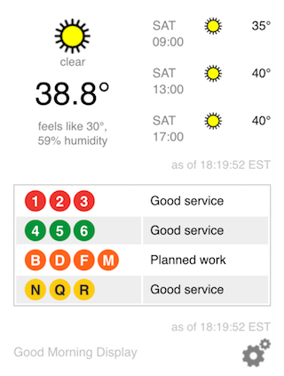

# Good Morning Display

This is simple display that shows weather NYC and NJ transit information. It was created mostly as a proof of concept and is very much a work in progress. **Proceed at your own risk**.

Currently, it looks best on a small, smartphone screen. Although, it works fine on larger displays. It uses local storage, so you'll need a modern browser.

Read more here: [Good Morning Display](http://jpreardon.com/projects/good-morning-display/).

##Instructions

1. Get a [Weather Underground API key](http://www.wunderground.com/weather/api/).

2. Put the contents of this repository on a server somewhere and ensure that the python scripts in cgi-bin are executable. An .htaccess file is included in the cgi-bin directory to add a Python file handler. I needed this for my hosted environment, you might not. If you are running this from your local machine, you'll need to run a webserver, otherwise the transit script won't work. There are several ways to do this, one easy way is to run <code>python -m CGIHTTPServer</code> in the root directory (same as index.html).

3. Hit index.html with a browser. You'll be prompted to enter your Weather Underground API Key, zip code and select which NYC subway lines you want to display. Optionally, the stop ID and route number for one NJ Transit bus stop can be entered. All of the preferences are stored in the browser.

Copyright (c) 2013-15 John P. Reardon Licensed under the MIT license.
