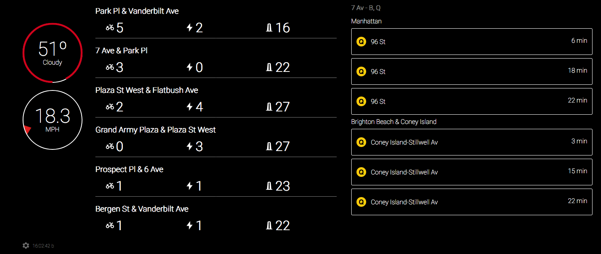

# Good Morning Display

**Note: Version 2.0.3 will most likely be the last release of V2. V3 is in the works!**

This is simple display that shows weather and real-time NYC transit information (Subway and Citibike).

More detailed notes for this and prior versions are in the [worklog](WORKLOG.md).

To get subway information, you'll need a (free) [API key from the MTA](https://new.mta.info/developers).

## Installation

Copy the following to an HTTP server somewhere:

- 📁 images
- 📁 javascript
- 📁 styles
- 📄 index.html
- 📄 settings.html
- 📄 manifest.json

Open settings.html and enter your local information.

⚠️ Disclaimer: I made this for myself, and I'm still working on it. There may be some "it works on my machine" type issues. If you run across any problems, feel free to open an [issue](https://github.com/jpreardon/good-morning-display/issues).

Copyright (c) 2013-26 John P. Reardon Licensed under the MIT license.
